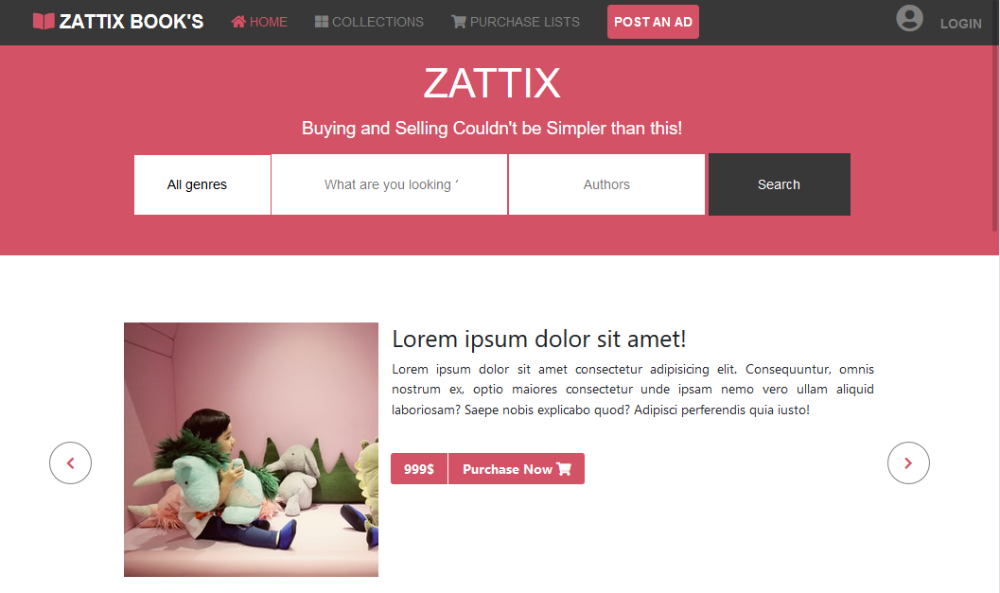
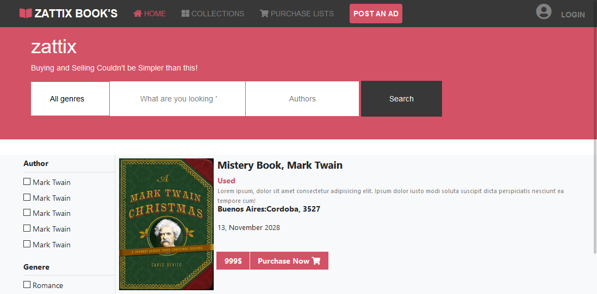
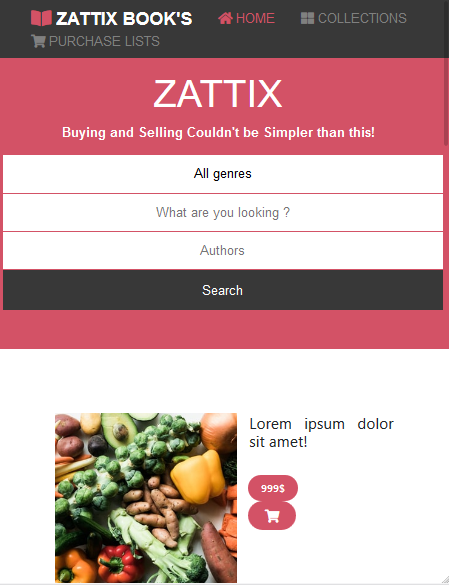

# Capstone-Html-CSS-Project

> The project for the HTML & CSS Capstone Project is based on an online shop, fit with a responsive design for desktop, tabes and smartphones.
 
 
 
 

 

 

 Additional description about the project and its features.

## Built With

- HTML
- CSS
- Bootstrap 4

## Live Demo

[Live Demo Link](https://raw.githack.com/SigmaSam/Capstone-Html-CSS-Project/development/index.html)

## Getting Started

To get a local copy up and running follow these simple example steps.

- Open a web browser

- [Visit Repository](https://github.com/SigmaSam/Capstone-Html-CSS-Project/tree/master)

- Download Repository

- Run index.html file (into folder html)

## Author

**Samuel Isaac Almao Herrera**

- Github[@SigmaSam](https://github.com/SigmaSam)

Contributions, issues and feature requests are welcome!

Feel free to check the [issues page](https://github.com/SigmaSam/Capstone-Html-CSS-Project/issues).

## Show your support

Give a  if you like this project!

## Acknowledgments
-[Original design Idea](https://www.behance.net/M_Awad)
- Hat tip to anyone whose code was used.
- Inspiration.
- etc.

## License

This project is [MIT](lic.url) licensed.
